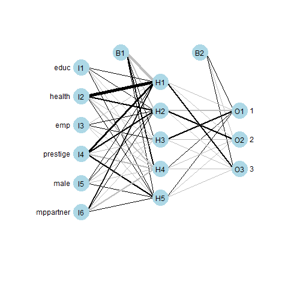

# ANN architecture prediction performance analysis.
Assessing the Impact of Architecture Variations on Artificial Neural Network (ANN) Prediction Performance.

These are - in a nutshell - the main bullet points that have been approached:

+ **File reading (.CSV)**
+ **Check number of records and create overview table**
+ **Generate overview with relevant metrics (min,1st Qu, Median, Mean, 3rd QU, Max)**
+ **Spot missing values**
+ **Normalize data, excluding 'label' variable**
+ **Create a .CSV file with non-normalized data**
+ **Create training and test dataset**
+ **Train the neural network according to max.iterations value.**
+ **Plot neural network with Devtools**
+ **Caret package & Confusion matrix**
+ **Improve Neural Network by means of optimizal sizing**
+ **Automate neural sizing definition**

# ANN architecture variations

# Selected architecture
 
